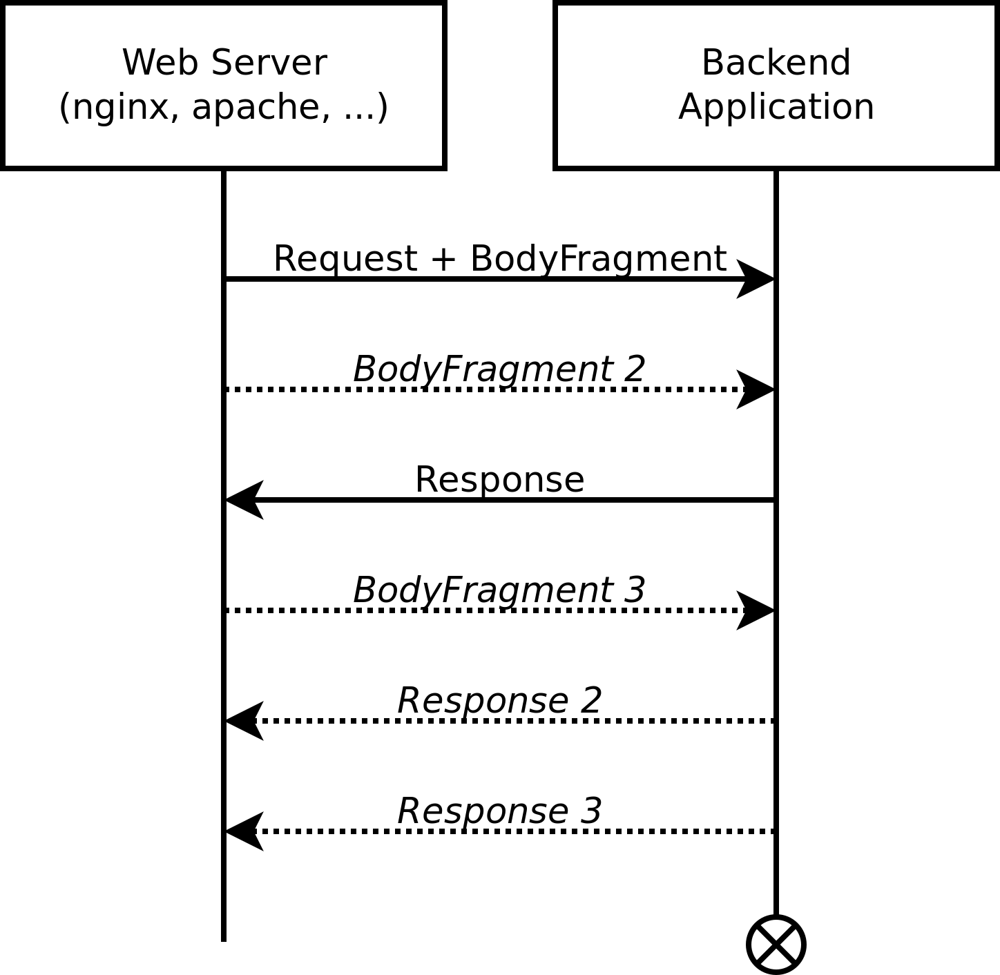

# tokio_scgi

This is a Rust library which implements support for building [SCGI](https://python.ca/scgi/) servers and clients. It comes in the form of a Tokio Codec which can be used in asynchronous code, but it can also be invoked directly in synchronous or non-Tokio code.

SCGI is a [simple and efficient](http://python.ca/scgi/protocol.txt) protocol for communicating between frontend web servers and backend applications over a TCP or local Unix socket. It compares (favorably) to [FastCGI](https://en.wikipedia.org/wiki/FastCGI), another protocol with a similar purpose. This library provides support for writing both SCGI servers and clients in Rust, with support for both TCP and Unix sockets.


A common use case would be a web server which queries a separate backend service for certain requests. The web server would be the SCGI client and the backend service would be the SCGI server. Note that the SCGI server should not be directly visible to the public internet, instead it should only be accessible via the web server which is effectively proxying it.

# Quick Start

Add the `tokio-scgi` library to your `Cargo.toml` as follows:

```
[dependencies]
tokio-scgi = "0.1.0"
```

See the [examples](examples/) for asynchronous usage as Tokio codecs, or the [tests](tests/) for synchronous usage via direct invocation.

## Asynchronous Examples

The following steps will build example server and client programs from the [examples](examples/) directory. These programs go through the exercise of creating an asynchronous SCGI server and client using Tokio. These are intended to be a starting point for your own applications, or as examples for adapting this codec into your existing applications.

Build:
```
$ cargo build --examples
```

Run TCP server and client (in separate tabs):
```
$ ./target/debug/examples/server localhost:2345
Listening on [::1]:2345

$ ./target/debug/examples/client localhost:2345
Connecting to [::1]:2345
Got 437 bytes:
HTTP/1.1 200 OK
Content-Type: text/html
Content-Length: 372

<html><head><title>scgi-sample-server</title></head><body>
<p>hello! the epoch time is 1561973905.19865964s, and your request was:</p>
<ul><li>headers: [("Content-Length", "46"), ("SCGI", "1"), ("Content-Type", "application/json"), ("X-Username", "bort")]</li>
<li>body (46 bytes): {"description": "my name is also bort &lt;&gt;&lt;&gt;&lt;&gt;"}</li></ul>
</body></html>

```

Run Unix socket server and client (in separate tabs):
```
$ ./target/debug/examples/server /tmp/scgi-demo.sock
Listening on /tmp/scgi-demo.sock

$ ./target/debug/examples/client /tmp/scgi-demo.sock
Connecting to /tmp/scgi-demo.sock
Got 438 bytes:
HTTP/1.1 200 OK
Content-Type: text/html
Content-Length: 373

<html><head><title>scgi-sample-server</title></head><body>
<p>hello! the epoch time is 1561973762.821642572s, and your request was:</p>
<ul><li>headers: [("Content-Length", "46"), ("SCGI", "1"), ("Content-Type", "application/json"), ("X-Username", "bort")]</li>
<li>body (46 bytes): {"description": "my name is also bort &lt;&gt;&lt;&gt;&lt;&gt;"}</li></ul>
</body></html>
```

## Synchronous/non-Tokio usage

The library can also be invoked directly to parse or create SCGI requests in synchronous or non-Tokio code. See the [tests](tests/) for examples of direct invocation.

## Web server usage

Many web servers have built-in support for enabling an SCGI client. For example, you could write your SCGI server in Rust, then have an external web servers invoke your code when certain paths are queried.

- **nginx** using [`scgi_pass`](http://nginx.org/en/docs/http/ngx_http_scgi_module.html#scgi_pass). nginx will forward queries to `/api` to the SCGI server over a Unix socket file.
    ```
    server {
      listen 80;
      ...
      location /api/ {
        include scgi_params;
        # unix socket (faster):
        scgi_pass unix:/tmp/scgi.sock;
        # tcp connection (more flexible):
        #scgi_pass localhost:4000;
      }
    }
    ```

- **Apache HTTP** using [`mod_proxy + mod_proxy_scgi`](https://httpd.apache.org/docs/2.4/mod/mod_proxy_scgi.htm). Apache will forward queries to `/api` to the SCGI server over TCP localhost:
    ```
    ProxyPass /api/ scgi://localhost:4000/
    ```

# Protocol

The request format is defined as follows:
```
pub enum SCGIRequest {
    /// The first Vec contains the headers. The second Vec optionally contains raw byte data from
    /// the request body.
    Request(Vec<(String, String)>, BytesMut),

    /// Additional body fragment(s) to be used for streaming request data.
    BodyFragment(BytesMut),
}
```

For a given request session, the SCGI service would first receive a `Request` containing the request headers, optionally paired with some request body data. If the requesting service (HTTP server) fragments or streams the request body into multiple packets, the SCGI service will receive the packets as `BodyFragment`s following that `Request`. As the packets arrive, the SCGI service can either start its response immediately or it can wait for all of the request to arrive first. The response format is up to the application and is not handled by this codec, but in practice it would typically be an HTTP response. After sending the response, the SCGI service then closes the socket.

The following diagram shows an example of a fragmented request from the HTTP server to the SCGI service which is answered with a fragmented response. This is done without necessarily waiting for all of the request fragments to arrive. The optional parts are in _italics_:



Again, support for fragmented requests and responses is an optional feature that's only necessary for certain applications involving large or streamed payloads. Most services will be well-served by just waiting for the main `Request` object, doing some work, then sending back the response. No `BodyFragment`s required. However, the provided [examples](examples/) include a sample implementation of using the `Content-Length` header to detect when a fragmented request has all arrived.

# Contributing

Contributions are welcome. The code is structured as follows:

- `src/`: The Encoder+Decoder and any supporting code. The Encoder is for SCGI clients while the Decoder is for SCGI servers.
- `tests/`: Tests that exercise the Encoder and Decoder.
- `examples/`: Example standalone Tokio server and client.

To run tests:
```
$ cargo test
```

The example server can be manually invoked over a plain TCP socket. `0:,` equates to an SCGI request containing empty headers:
```
$ telnet localhost 2345
0:,
```

# Licence

The Tokio-SCGI library is copyright Nicholas Parker and other contributors. In order to align with the licencing of [Tokio itself](https://github.com/tokio-rs/tokio/blob/master/LICENSE), Tokio-SCGI is provided under the [MIT license](LICENCE.txt).
